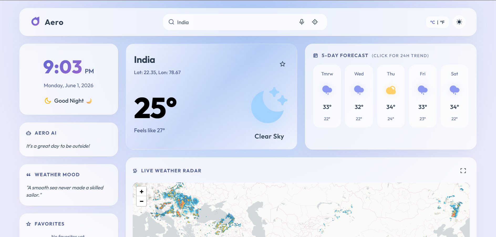

# 🌦️ Aero | Premium Weather Dashboard

A modern and interactive Weather Dashboard built using HTML, CSS, and JavaScript. Aero provides real-time weather information, 5-day forecasts, live weather radar, air quality monitoring, allergy outlooks, environmental insights, and temperature trend visualizations through a clean glassmorphism-inspired user interface.

---

## 📸 Dashboard Preview

### Main Dashboard



### Live Weather Radar


### Air Quality Index


### Environmental Insights


### 24-Hour Temperature Trend


---

## ✨ Features

### 🌤️ Real-Time Weather Information

* Current weather conditions
* Real-time temperature updates
* Feels-like temperature
* Humidity tracking
* Wind information
* Visibility metrics
* Atmospheric pressure

### 📅 5-Day Forecast

* Daily weather predictions
* High and low temperatures
* Weather condition icons
* Interactive forecast cards

### 🗺️ Live Weather Radar

* Interactive weather radar
* Rain layer visualization
* Temperature overlay
* Zoom and pan support
* Fullscreen viewing mode

### 📈 24-Hour Weather Trends

* Interactive temperature charts
* Hourly weather visualization
* Smooth chart animations
* Responsive data display

### 🌍 Environmental Insights

* Sunrise and sunset timings
* Atmospheric pressure
* Dew point monitoring
* Visibility conditions

### 🍃 Air Quality Monitoring

* AQI tracking
* PM2.5 levels
* PM10 levels
* NO₂ monitoring
* O₃ monitoring
* Air quality recommendations

### 🌱 Allergy Outlook

* Tree pollen information
* Grass pollen information
* Dust levels
* UV Index tracking

### 🎙️ Smart Features

* Voice search functionality
* Geolocation-based weather retrieval
* Dynamic location search
* Favorites support

### 🎨 User Experience

* Light Mode
* Dark Mode
* Responsive design
* Smooth animations
* Modern glassmorphism UI
* Interactive widgets
* Dynamic weather backgrounds

---

## 🛠️ Technology Stack

### Frontend

* HTML5
* CSS3
* JavaScript (ES6+)

### APIs

* Open-Meteo Weather API
* Open-Meteo Air Quality API
* Nominatim Geocoding API
* RainViewer Radar API

### Libraries & Tools

* Leaflet.js
* Chart.js
* SortableJS
* Remix Icons

### Development Tools

* Git
* GitHub
* Visual Studio Code

---

## 📂 Project Structure

```text
Weather dashboard/
│
├── screenshot.png/
│   ├── air quality.png
│   ├── dashboard.png
│   ├── env insights.png
│   ├── temp trend.png
│   └── weather radar.png
│
├── .gitignore
├── index.html
├── LICENSE
├── README.md
├── script.js
└── style.css
```

---

## 🚀 Getting Started

### Clone the Repository

```bash
git clone https://sachin-220.github.io/Weather-Dashboard/
```

### Navigate to the Project Folder

```bash
cd aero-weather-dashboard
```

### Run Locally

Using Python:

```bash
python -m http.server 8000
```

Open your browser and visit:

```text
http://localhost:8000
```

### Alternative

You can also run the project using:

* VS Code Live Server Extension
* XAMPP
* Any local web server

---

## 🎯 Learning Outcomes

This project demonstrates:

* REST API Integration
* Asynchronous JavaScript (Fetch API & Async/Await)
* Dynamic DOM Manipulation
* Data Visualization using Chart.js
* Interactive Maps using Leaflet.js
* Responsive Web Design
* Modern UI/UX Principles
* Geolocation Services
* Voice Recognition APIs
* Frontend Performance Optimization

---

## 💡 Future Enhancements

* Weather alerts and notifications
* Multi-language support
* Weather history tracking
* Advanced radar layers
* Export weather reports
* Progressive Web App (PWA) support
* Offline weather caching

---

## 👨‍💻 Author

**Sachin**

2nd Year B.E. Computer Science and Engineering

Developed as a frontend web development project focused on modern UI/UX design, weather data visualization, and API integration.

---

## 📄 License

Copyright © 2026 Sachin

All Rights Reserved.

This project is intended for educational, portfolio, and demonstration purposes. Unauthorized commercial use, redistribution, reproduction, or resale of this software is prohibited without explicit permission from the author.
